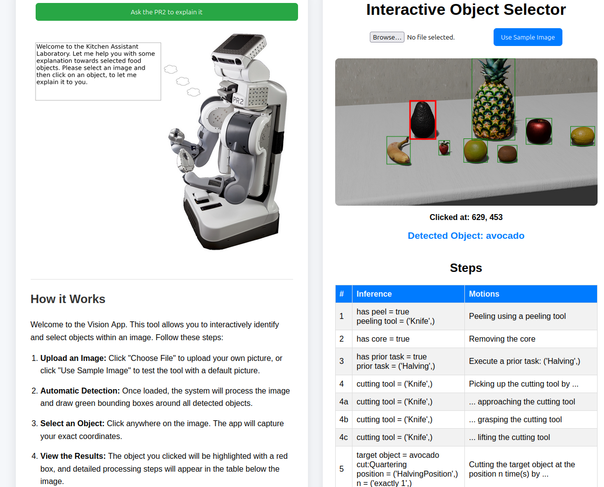

# Entity Linking Laboratory

An interactive tool for grounding semantic concepts from ontologies into real-world images. This application allows users to upload images, perform object detection, and link detected entities to complex ontological structures for robotic task planning (e.g., food cutting motions).

---

## 🌟 Features

- **Object Detection**: Automatically identify bounding boxes for objects in images.
- **Zero-Shot Classification**: Uses CLIP to classify detected objects based on ontology-derived labels.
- **Ontological Reasoning**: Integrates with OWL ontologies (SOMA, MEALS, DUL) using `owlready2` and the Pellet reasoner.
- **Task Planning**: Generates motion sequences (e.g., for robotic cutting) based on clicked objects.
- **Interactive UI**: Upload your own images or use samples to interact with the underlying knowledge base.

---

## 📸 Screenshots

<!-- Placeholder for a main app screenshot -->

*Example of the main interface showing object detection and semantic linking.*

---

## ⚙️ Prerequisites

- **Python 3.8+**
- **Docker & Docker Compose** (optional, for containerized deployment)
- **CUDA-compatible GPU** (highly recommended for performance, though CPU is supported)
- **Ontology Files**: Ensure your `.owl` files are located in `models/ontologies/`.

---

## 🚀 Installation & Setup

### 1. Docker (Recommended)

The easiest way to get started is using Docker Compose.

1. **Clone the repository**:
   ```bash
   git clone <repository-url>
   cd entity_linking_laboratory
   ```

2. **Set up Environment Variables (Optional)**:
   Create a `.env` file in the root or export them in your shell if you want to use the AI explanation feature with your own API:
   ```bash
   export LLM_API_URL="your-api-url"
   export LLM_API_KEY="your-api-key"
   export LLM_MODEL="your-model-name"
   ```
   *If no API key is provided, the PR2 will use hardcoded ontological rules to provide explanations.*

3. **Run Docker Compose**:
   ```bash
   cd docker
   docker compose up --build
   ```

### 2. Local Setup

If you prefer to run it locally:

1. **Clone the repository**:
   ```bash
   git clone <repository-url>
   cd entity_linking_laboratory
   ```

2. **Create a virtual environment**:
   ```bash
   python3 -m venv venv
   source venv/bin/activate
   ```

3. **Install dependencies**:
   ```bash
   pip install -r requirements.txt
   ```

4. **Run the application**:
   ```bash
   python3 app.py
   ```

The application will be accessible at [http://localhost:5000/](http://localhost:5000/).

---

## 🛠️ Project Structure

- `app.py`: Flask web server and API endpoints.
- `scripts/`: Core logic for object detection, ontology parsing, and task planning.
  - `pipeline.py`: Orchestrates detection and linking.
  - `cutting_queries.py`: Logic for generating motion tables.
- `models/`: Contains ontologies (`.owl`) and weight files.
- `static/`: Frontend assets (CSS, JS, Uploads).
- `templates/`: HTML templates for the Flask app.

---

## 📖 Usage

1. **Upload an image** or use the provided sample.
2. **Detect Objects**: Click the detection button to see bounding boxes.
3. **Interact**: Click on a detected object to see its ontological classification and generated motion steps for a specific task (like "Quartering").

---

## 📜 License

[Add License Information Here]